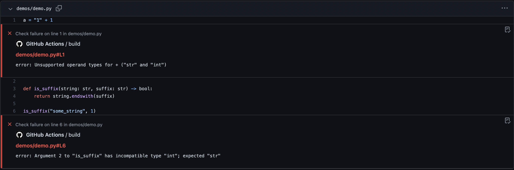

# Mypy PR Annotator



## Usage

Annotate pull requests with mypy errors detected during CI.

Note: This doesn't install or run mypy, it just sets up the PR annotations.

### Example workflow

```yaml
name: My Workflow
on: [push, pull_request]
jobs:
  build:
    runs-on: ubuntu-latest
    steps:
      - uses: actions/checkout@master

      - name: Set up Python 3.8
        uses: actions/setup-python@v2
        with:
          python-version: "3.8"
        
      - name: Install mypy
        run: |
          pip install mypy

      - name: Add mypy annotator
        uses: pr-annotators/mypy-pr-annotator@v1.0.0

      - name: Run mypy
        run: |
          mypy src/
```
